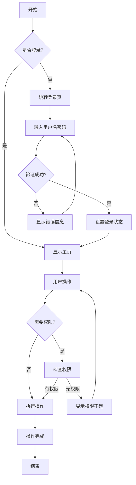
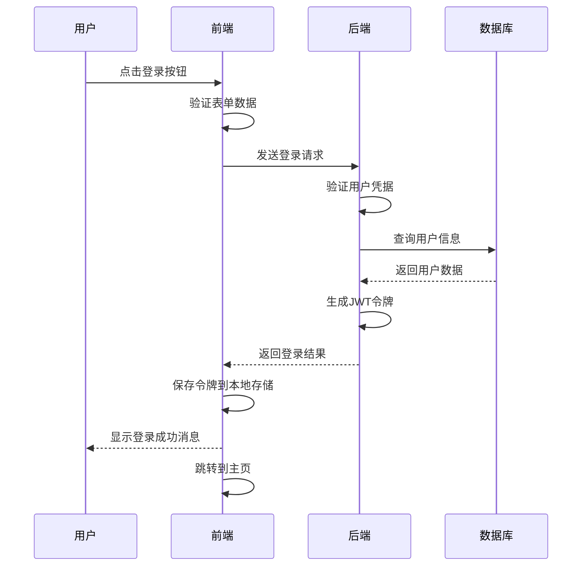
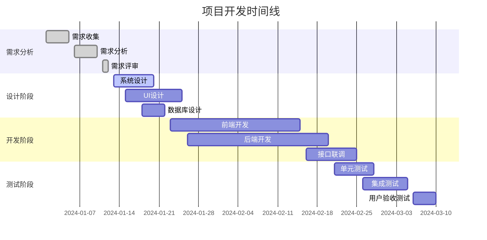

# Mermaid 图表全宽展示测试

这个文档用于测试 DeepWhite 主题中 mermaid 图表的全宽展示功能。

## 1. 普通代码块测试

下面是一个普通的 JavaScript 代码块，应该保持在写作区域的宽度限制内：

```javascript
// 这是一个普通的代码块
function calculateSum(a, b) {
    return a + b;
}

const result = calculateSum(10, 20);
console.log(`计算结果: ${result}`);

// 这个代码块应该保持在 80ch 的宽度限制内
const longVariableName = "这是一个很长的字符串，用来测试代码块的宽度限制是否正常工作";
```

## 2. Mermaid 流程图测试

下面是一个 mermaid 流程图，应该突破宽度限制，全宽展示：



## 3. Mermaid 时序图测试



## 4. 普通 Python 代码块

这是另一个普通代码块，用于对比：

```python
# Python 代码示例
class UserManager:
    def __init__(self):
        self.users = {}
    
    def add_user(self, username, email):
        """添加新用户"""
        if username not in self.users:
            self.users[username] = {
                'email': email,
                'created_at': datetime.now(),
                'active': True
            }
            return True
        return False
    
    def get_user(self, username):
        """获取用户信息"""
        return self.users.get(username, None)

# 使用示例
manager = UserManager()
manager.add_user("张三", "zhangsan@example.com")
user_info = manager.get_user("张三")
print(f"用户信息: {user_info}")
```

## 5. Mermaid 甘特图测试



## 6. 对比总结

通过上面的测试，你应该能看到：

- **普通代码块**：保持在写作区域的宽度限制内（约80个字符宽度）
- **Mermaid图表**：突破宽度限制，占据全屏宽度，更好地展示复杂图表

这样的设计既保持了文本内容的可读性，又让图表有足够的空间展示详细信息。